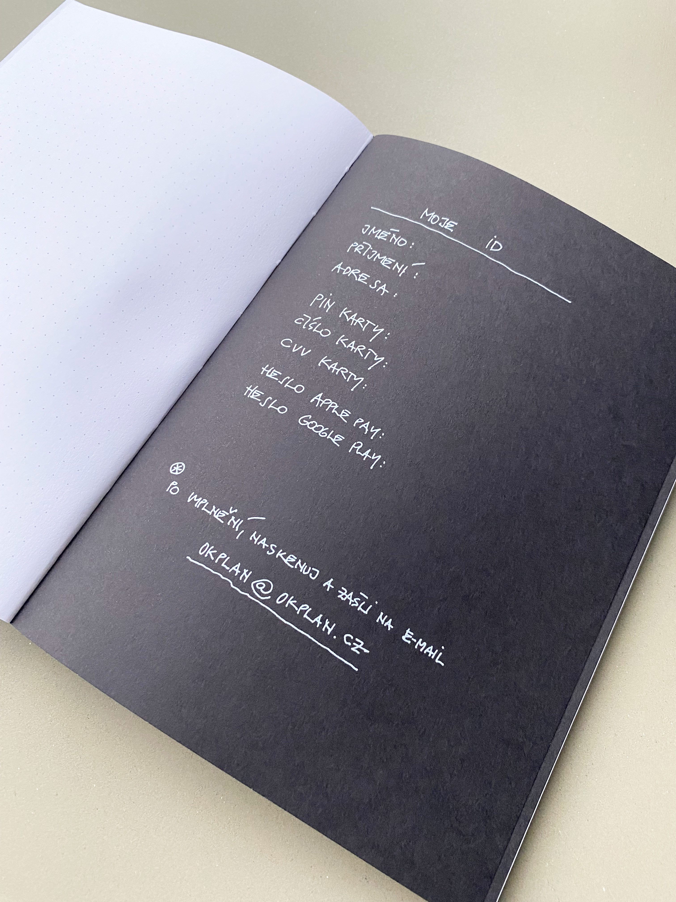

# Ok Plan Architects Journal

### Duration: 2 months
### Published: September 2022

Ok Plan Architects is an architectural studio located in Humpolec and Prague. Luděk Rýzner founded the company in 1999 and wanted to celebrate its 23rd anniversary by publishing an Ok Plan Journal.

First I wanted to set up the look of the pages and create a simple layout. From the start, I knew I would choose dotted lines in the journal since architects like to sketch. For that, it would be nice to use clear pages, but that would make making notes harder. That's why dotted lines are the perfect medium.

I decided to use an exposed sewn stitch bookbinding. That means the number of pages that is dividable by 8. I chose a pink thread because it's one of Ok Plan Architects' brand colors.
The cover is made out of 500gsm black paper. The higher the gsm number is, the longer it will last without damage.

Exalt not the worthy,

so that the people will not fight.

Prize not the rare treasure,

so that they will not steal.

Exhibit not the desirable,

so that their hearts will not be distracted.

Therefore in governing,

the Sage empties the people's hearts and fills their stomachs,

weakens their will and strengthens their bones.

He always keeps them void of knowledge and desire,

so that those who know will not dare to act.

Acting through inaction, he leaves nothing ungoverned.

  – Lao-tzu
                                                                                          

Inside the journal there is a section where the pages are black and the text is printed onto them in white color. This section contains poems from The Canon of Reason and Virtue by Lao Tzu, which was an ancient Chinese philosopher and writer. On this section's first and last page are hand-drawn sketches by Ludek Ryzner.

Some of the pages have a specific design on them. All the employees of Ok Plan Architects had the chance to create their own design of two pages inside the journal. They only had to come up with the idea, of what they wanted to put there and I created the design digitally. There are 12 personal designs in total. 
