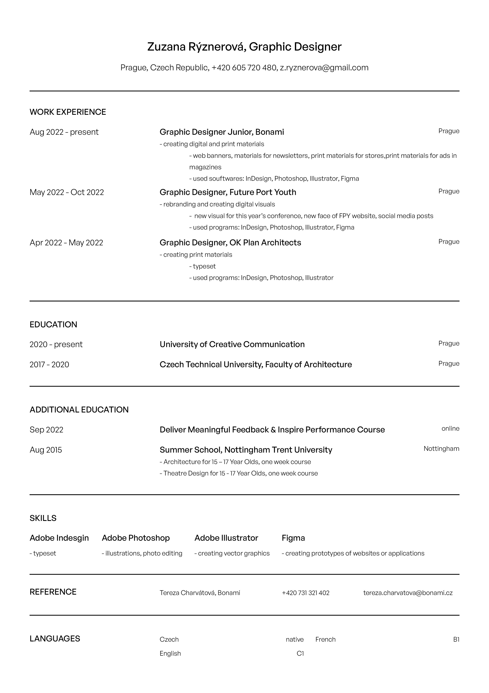

# My CV

### Zuzana Rýznerová

I'm a graphic designer and illustrator now living in Prague.

## Experience

- ### Bonami, Graphic Designer Junior (Aug 2022 - present)
- Creating digital and print materials
  - Web banners, materials for newsletters, print materials for stores, magazine ads
  - Co-working with other teams via Slack and Asana
  - Used softwares: Illustrator, Photoshop, InDesign, Figma, Slack, Asana

- ### Future Port Youth, Graphic Designer (May 2022 - Oct 2022)
- Rebranding and creating digital visuals
  - New visual for this year's conference, new face of FPY website, social media posts
  - Communication via Google Meets, Slack and ClickUp
  - Used softwares: Illustrator, Photoshop, Figma, Slack, ClickUp

- ### OK Plan Architects, Graphic Designer
- Creating new notebook (see more [here](03-content-first/index.md) )

