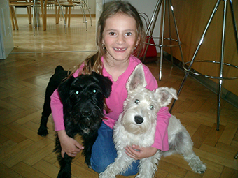

# HOW TO WAKE UP YOUR INNER CHILD

Sometimes, especially these days, I feel like my creativity has run out. We are all finishing our bachelor's thesis, so if you're running out of creativity, it kinda sucks. 

Usually, I would just sit on the couch, and watch some tv, hoping that that would make me more creative. I would go for a walk with my dog, cook a new recipe, and do all the things adults tell you to do if you've run into a wall. But it never got me anywhere. 

So I was thinking: Why is this shit not working?! And that was when I realized, that all these articles trying to help you get more creative, are all the same. So how are they supposed to help us, when not even the authors are creative.

Maybe you feel the same way. 

Well! Here I am with the idea to try to find your creative inner child (and I'm not saying that I'm the only one, who've come up with this idea, but at least I'm not one out of a million)! 

So today I'm going to show you a couple of ways to try to find your inner child's creativity.

### PLAYTIME WITH KIDS
The easiest way to unlock your inner child would be to play with an actual child. I'm always surprised by how my small cousins see the world, and I get inspired by it quite a lot. And hear me out, I'm not saying that if you don't have cousins, you should go to a playground and kidnap one. I mean, you can, but don't bring me into it.

Though, I have an alternative. Play with a dog (hopefully, you're not allergic). Dogs are your play buddies forever...even if they're not willing participants. 

### EAT YOUR FAVORITE CHILDHOOD SWEETS
Go to a grocery shop and buy all your favorite candies and sweets, that you loved as a child and binge on them.

### RECOLLECTING MEMORIES
So now, that you have all those candies and you're eating them, try to remember all those happy and funny memories from childhood. It helps you to relax, to stop thinking about all the stuff, that needs to be done.

### DO SOMETHING YOU LOVED DOING AS A CHILD
You ate all your cookies, you remembered all the good stuff and with that might have come up an idea to do something you loved as a child again. So do it. 
I loved playing with my dog Baron (he really hated it most of the time by the way). So now, the legacy of my oldest friend can continue via my dog Lars. Because he also has to play with me.

### SPOIL YOURSELF
Now that your dog is fed up with you, it's time to go shopping. As kids, we all had toys that we desperately wanted. And I bet, you still have your wish list. Even if it's not filled with toys, but with shoes, clothes, or whatever you like. So go for it. Buy some of the things you really want. Yes, your account is going to be crying and you might have to eat plain toast for the rest of the month, but that is a problem of the tomorrow YOU. 

### FEEL THE WORLD THROUGH DIFFERENT SENSES
Now, that you're on your way home from shopping, try to feel the world a bit differently. Don't put your headphones on. Instead, listen to what is happening around you. Don't just blankly stare at the pavement. Try to see small details that you would normally miss. If you want to touch something, do it. But please don't touch strange people. That wouldn't be okay. 

I didn't have a picture for this one, so enjoy my brother experiencing being a kangaroo.

### PLAY YOUR FAVOURITE GAMES
You've arrived home. What now? Pick up some good old games, that you loved as a child and game on. I loved playing the Sims and I still play to this day. Am I ashamed of those 500 hours of gameplay, that I'll never get back? Not really. Would I tell my parents about all those hours and how much I spent on the game? Definitely no. What I love about the Sims is, that in the game I can do whatever I want to. I can have colorful furniture and loud wallpapers. In real life, I would never! The game is my guilty pleasure and it helps me relax.

### READ CHILDREN'S FANTASY
It's quite late, your computer is fried, and you should probably go to bed. You don't want this day to end? Well, you could try to do some reading. How about picking up some children's fantasy? Harry Potter, Narnia, Percy Jackson. Those are easy to read and they're quite engaging.

Apparently, I don't have a picture of me reading, so here is a picture of me with a random bell.

### DIDN'T WORK?
Well, you can always drink some alcohol, because that can turn an adult into a child for sure!

So have you noticed something? All of these are not about ways to be more creative.  Engaging in these activities will make you happier. As kids, we had almost no worries and if we had, they were so trivial.

I believe this one thing.
A happy brain equals a creative brain.
So if you're feeling stuck, do something that makes you happy and you'll see, that new ideas will certainly arise.
